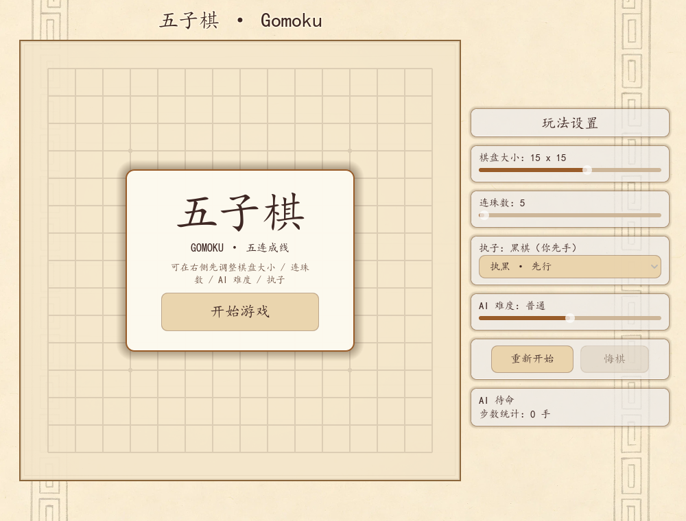
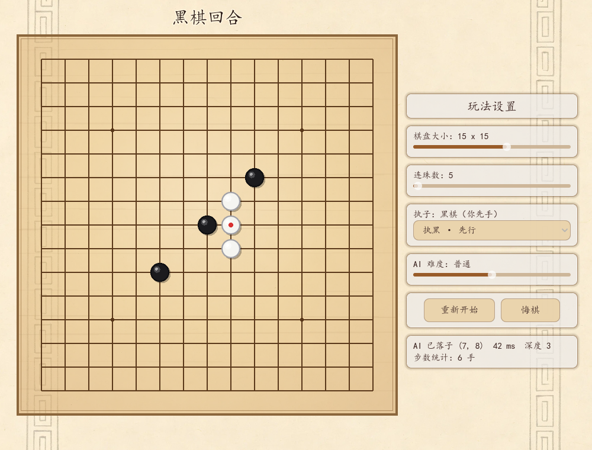
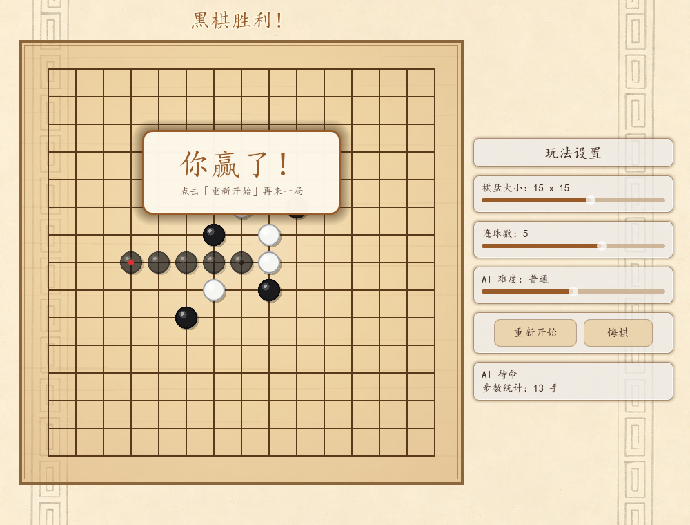
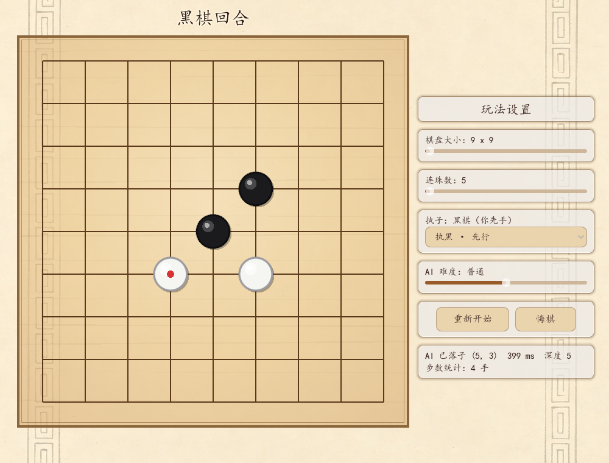
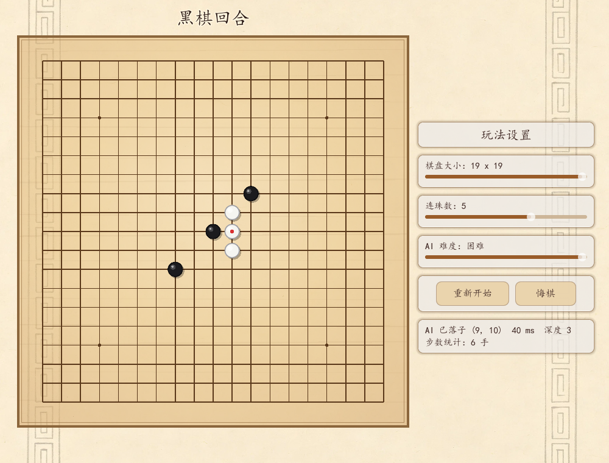

# 五子棋 Gomoku · Godot 4

基于 **Godot 4** 的五子棋图形化对战程序：**棋盘大小（9/11/13/15/17/19 路）、连珠数（5~6 连）、AI 难度（三档）、执子先后手** 均可实时调节，内置 Alpha-Beta 剪枝 AI，支持悔棋与重新开始。界面采用木色羊皮纸风格，文案全中文。





## 功能

- **开始界面**：标题卡 + 「开始游戏」按钮，可先在右侧配置玩法再开局；未开始时棋盘锁定、AI 不抢跑
- **可调玩法**：棋盘大小 **9/11/13/15/17/19 路（仅奇数）**、连珠数 5~6 连、AI 难度 1~3 档，右侧面板实时生效
- **执子可选**：执黑先行 / 执白后行（选执白时由 AI 先手）
- **棋盘渲染**：几何随尺寸自适应（格宽 / 棋子半径 / 星位全部动态计算）；半透明暖木棋盘叠在羊皮纸背景上
- **棋子立体感**：外阴影 + 边缘压暗 + 双层高光，做出球面质感；最后一手有红点标记
- **落子动画**：棋子以 `0.5× → 1.2× → 1.0×` 弹跳落下（Q 弹回弹），耗时 260ms
- **悬停预览**：鼠标停在空交叉点时显示半透明的当前回合色棋子
- **交互**：鼠标点击自动吸附到最近交叉点（半格容差），点按钮 / 拖滑块不会误落子
- **AI 对战**：玩家执黑先行，AI 执白应手；搜索深度随棋盘收敛，评估权重随连珠数调整
- **对局控制**：重新开始、悔棋（一次退回一整轮）、实时步数统计与 AI 思考状态
- **胜负反馈**：获胜连线呼吸式闪烁 + 棋盘上方淡入缩放的结算弹窗
- **音效**：程序合成的落子「砰」声，无需任何外部音频素材
- **木色主题**：楷体/宋体 + 深棕 `#3E2723` 文字 + `#FFFFFFAA` 半透明圆角面板

## 视觉与交互优化（v1.1）

v1.1 在**不改动任何棋局逻辑**的前提下完成了界面质感升级 —— `board.gd` 的棋盘状态代码与 `gomoku_ai.gd` 的调用契约均保持原样，所有动画都由视觉专用变量 + `Tween` 驱动。



完整技术细节（配色表、缓动曲线、实测缩放轨迹、验证数据）见 **[docs/UI_OPTIMIZATION.md](docs/UI_OPTIMIZATION.md)**。

## 玩法参数化与木色 UI（v1.2）

棋盘大小、连珠数、AI 难度全部变成**运行时参数**，右侧滑动面板实时调节 —— 而棋盘数组结构始终保持 `board[row][col]` 不变。

| 9 路 / 4 连 | 15 路 / 5 连 | 19 路 / 5 连 |
|---|---|---|
|  |  |  |

- **几何自适应**：格宽与棋子半径随尺寸重算（9 路格宽 70px / 半径 28px，19 路 31px / 12px），星位也按尺寸生成
- **AI 规则自适应**：
  - 搜索深度随棋盘收敛 —— 9 路 5 层、12 路 4 层、15 路 3 层、19 路 2 层（再按难度 ±1）
  - 评估权重随连珠数变化 —— 4 连时活三权重从 1000 提升到 **10000**，3 连时提升到 **50000**
  - 候选生成 / 成五点 / 活四点三处均加显式边界守卫
- **木色 UI**：羊皮纸回纹背景 + 半透明暖木棋盘 + 楷体/宋体 + 深棕 `#3E2723` 文字
- **滑动面板**：拖动中只更新文字，`drag_ended` 后才重建棋局（另加 0.3s 定时器兜底非拖动改值）
- **执子/先后手**：可切换「执黑 · 先行」与「执白 · 后行」，选执白后 AI 执黑先手
- **连珠数下限 5**：不存在五珠以下的玩法，滑块与 API 三层夹取

完整技术细节见 **[docs/V12_UPDATE.md](docs/V12_UPDATE.md)**。

## 比赛提交材料

完整说明文档见 **[docs/competition/](docs/competition/)**：

| 文档 | 内容 |
|---|---|
| [核心玩法与算法说明](docs/competition/01-gameplay-and-algorithm.md) | 玩法规则、操作方式、AI 算法完整拆解（评估函数 / 搜索 / 置换表 / 规则自适应）、性能实测、参数速查表 |
| [创意与技术说明](docs/competition/02-innovation-and-technology.md) | 设计理念、6 个创意点、三层技术架构、8 个真实技术难点的根因与解决、工程实践与验证体系 |

> 同一目录下另有**可直接提交的 Word 与 PDF 版本**：
> `五子棋-核心玩法与算法说明.docx` / `.pdf`、`五子棋-创意与技术说明.docx` / `.pdf`、
> `五子棋-比赛材料索引.docx` / `.pdf`。

## 快速开始

需要 **Godot 4.5+**（本项目在 4.7.2-stable 上开发验证）。

```bash
git clone <this-repo>
cd game3
# 用 Godot 打开本目录，或直接命令行运行：
godot --path . --rendering-driver opengl3
```

主场景为 `res://scenes/Main.tscn`，已在 `project.godot` 中配置，启动即进入对局。

## 项目结构

```
game3/
├── project.godot          # 主场景 / 窗口 1000x760 / 版本号 / 自动加载
├── CLAUDE.md              # 引擎与代码约定参考（含接口契约、已修复的坑）
├── scenes/
│   └── Main.tscn          # 主场景：BoardUI + 羊皮纸背景 + RightPanel
├── scripts/
│   ├── board.gd           # 棋盘：参数化几何 + 绘制 + 状态 + 输入
│   ├── ui.gd              # 界面：木色主题 / 滑动面板 / 弹窗 / 音效
│   └── gomoku_ai.gd       # AI 算法（纯 RefCounted，规则自适应）
├── assets/
│   └── ui/wood_bg.png     # 木色羊皮纸回纹背景
├── docs/                  # 配图与技术说明文档
└── addons/godot_ai/       # Godot AI MCP 编辑器插件（开发工具，随项目一并提交）
```

### 架构

```
玩家点击棋盘
   └─ board.gd::_input()                 像素坐标 → 最近交叉点
        └─ place_stone(row, col)         更新棋局状态
             ├─ emit stone_placed        状态更新完毕后再广播
             └─ emit game_over           仅终局

ui.gd::_on_stone_placed()
   ├─ 刷新轮次 / 步数 / 按钮可用性
   └─ 轮到 AI → gomoku_ai.get_best_move() → board.set_ai_move()
```

棋盘用 `Array[Array]` 表示，`board[row][col]`，`0=空 / 1=黑 / 2=白`。

## AI 算法

Negamax + Alpha-Beta 剪枝，迭代加深，2 秒硬超时。

- **评估函数**：五连 1000000 / 活四 100000 / 冲四 10000 / 活三 1000 / 眠三 100 / 活二 10，支持跳型（`XX_XX` 计冲四、`X_XX` 计活三）
- **增量式线型评分**：棋盘预切为「线」，落子只重算经过该点的 4 条线，叶子评估 O(1) —— 这是深度 5 能压进 2 秒的关键
- **置换表**：Zobrist 增量哈希 + 单 int64 打包（分数/depth/flag/move），含 mate-ply 修正，20 万条封顶
- **候选点**：距任一棋子切比雪夫距离 ≤ 2 的空点，按 `攻×2 + 守` 排序，根 18 / 内部 12 个
- **战术预检**：搜索前先判「我方成五 → 对方成五必挡 → 我方成活四」，命中直接短路

实测（困难档，深度 5）：自对弈 25 手，单步最大 1537 ms，平均 661 ms；普通档单步约 27 ms。

## AI 接口契约

`scripts/gomoku_ai.gd` 是纯算法文件（`extends RefCounted`，不触碰场景树），可独立替换：

```gdscript
func get_best_move(board: Array, ai_color: int) -> Vector2i  # 返回 (row, col)，无棋可下返回 (-1, -1)
func set_difficulty(level: int) -> void                      # 0=简单 1=普通 2=困难
func set_rules(win_count: int) -> void                       # 连珠数 3~6（棋盘尺寸从 board.size() 推断）
func reset() -> void
func get_last_stats() -> Dictionary                          # {"nodes", "depth", "score", "elapsed_ms"}
```

## 开发与验证

```bash
# 语法检查
godot --headless --path . --check-only --script "res://scripts/board.gd"

# 无头跑主场景，捕获运行期错误
godot --headless --path . --quit-after 90

# 带渲染运行
godot --path . --rendering-driver opengl3
```

> 注意：`--headless` 下视口尺寸与带渲染时不同，**鼠标点击相关测试必须在带渲染模式下运行**，否则会因 stretch 变换产生假失败。详见 `CLAUDE.md` §7。

## 已知事项

- `困难` 档搜索是同步的，最坏会阻塞主线程约 2 秒（界面已先绘制「AI 思考中…」）
- 项目未附许可证文件；如需开源请自行添加 LICENSE
